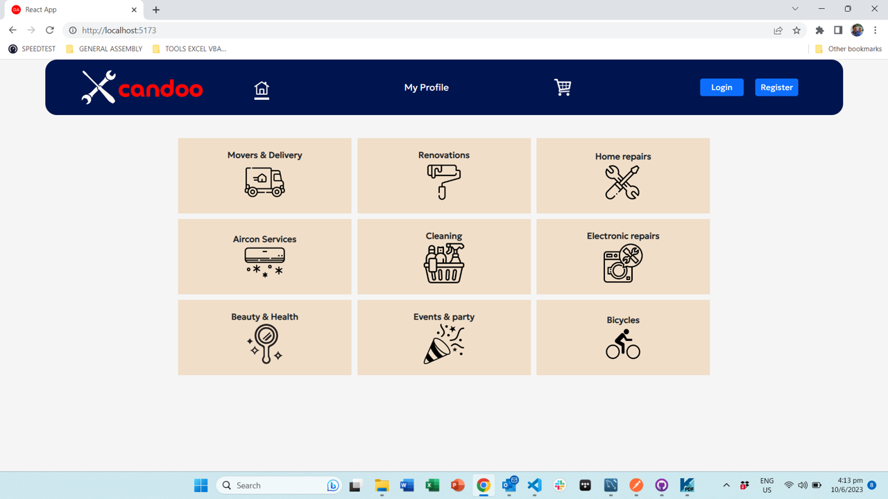
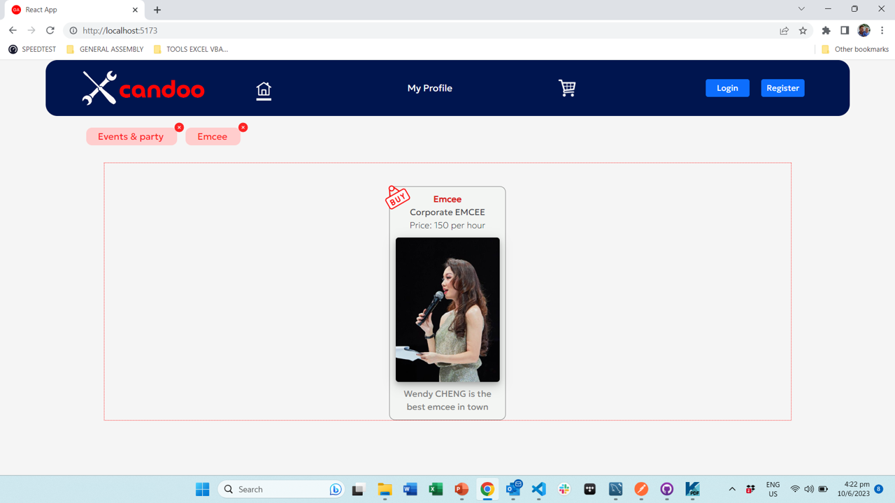
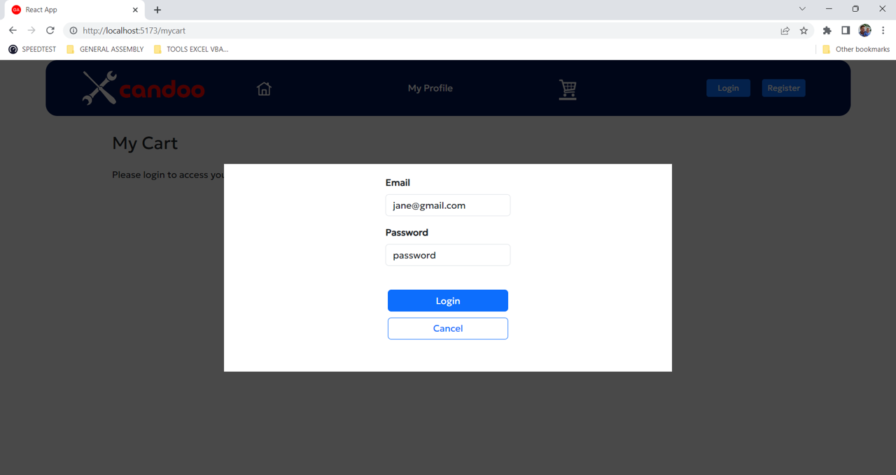
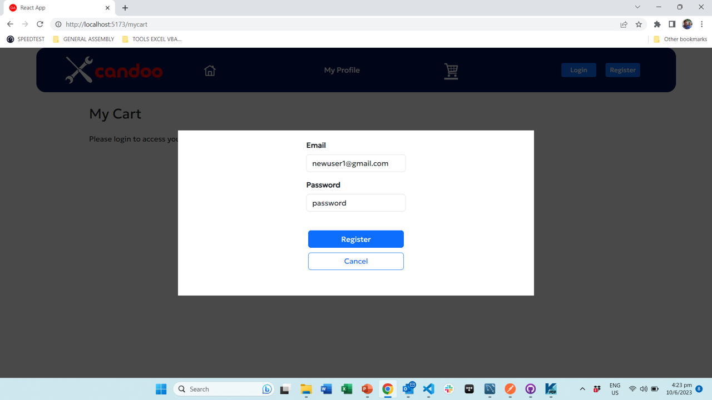

# CANDOO

Candoo is a react app selling professional services (handyman, plumber, repair services...).
 

## **Description**

The App is intended to be a simple e-commerce like app. On loading up the site, a user can browse available services for sale. When logged in, he can access his profiles and his cart.
An admin login allows a separate distinct administrator view.

   

## **Technologies used**

### M.E.R.N.

HealthConnect is a fullstack MERN app developped thanks to : MySQL, Express, React, Node.js (ie MERN), and uses PRISMA as an ORM  
[REACT BOOTSTRAP](https://react-bootstrap.netlify.app//) was used (i) for styling certain components (ii) to provide certain more complex pre-built components.
 

### Dependencies

FRONTEND

- "bootstrap",
- "bootstrap-icons",
- "react-bootstrap",
- "jwt-decode",
- "@heroicons/react",
- "react",
- "react-router",
- "react-router-dom",
- "react-dom"
- "@types/react",
- "@types/react-dom",
- "@vitejs/plugin-react",
- "vite"

BACKEND

- prisma client,
- bcrypt,
- cors,
- dotenv,
- express,
- express-validator,
- jsonwebtoken,
- uuid,

   

## Installation instructions

run `npm i`  
I used an mySQL database, together with the mySQL workbench UI.
The database is saved in the repo

 

## General flow & user stories

### Homepage

- When loading the app, the header is loaded together with the main homepage displaying a series of categories (Movers & delivery, Renovations, Home Repairs, ...)
  

- When clicking on a category, the homepage then displays the services available in that category together with any products available
  

- When clicking on a service, the homepage then filters down further and only displays the products available in that service together with any products available
  

All categories & services can be accessed whithout login in. When logged in a user can (i) edit his profile & payment methods (ii) add/modify items to sell if the user is a seller (ii) add/delete items to/from his cart

### Login/Register

- **login** is a modal with two fields (email & password)
  

- **Register** is identical to login, as a modal with two fields (email & password)
  
  When a new user registers, he is prompted to verify an email (no email is sent in the MVP version...)
  He can then log in immediately.

- Users cannot access the MyProfile or MyCart pages unless they are logged in.
  
  

  ​ 

### Buyer

After a user has logged in, he can access his profile and cart.
A user is a seller or a buyer depending on a single radio button in the profile details.

In the profile, if a user has already filled all his details, he will see all the details but editing is blocked.

A buyer's profile details in editing method

A buyer's payment methods:

Adding payment methods:

#### Seller

NOTE: A user is a seller or a buyer depending on a single radio button in the profile details.

After a seller has logged in, he can access his profile.
Unlike a buyer, a seller's profile features his services for sale: he can add, delete, modify those services  

Add a service:

Update a service:

## Controllers & routers

### **_Authentication_**

- **Login** uses bcrypt encryption of the password in the database. No password is stored in the database, only a hash

- Upon successful login, the user is allocated an access & refresh tokens: End points are all secured using JWT tokens

Below are the CRUD methods for the authentication & login of users:

- router.put("/register", checkValid, register);
- router.post("/login", checkValid, login);
- router.get("/users", checkValid, getAllAuthenticatedUsers);
- router.post("/user", checkValid, getAuthUser);

### **_User details_**

Below are the CRUD methods for the creation, updating, retrieval of user details, including payment methods:

- router.get("/users", adminAuth, getUsers);
- router.post("/user", auth, getOneUser);
- router.put("/users", auth, checkValid, putUsers);
- router.delete("/users", adminAuth, checkValid, deleteUser);
- router.patch("/users", auth, checkValid, patchUser);
- router.post("/user/paymentmeans", auth, getUserPaymentMeans);
- router.put("/user/paymentmeans", auth, addUserPaymentMeans);

### **_Services_**

Below are the CRUD methods for the categories, services & products for sale (seller_services):

- router.get("/categories", getAllCategoriesOnly);
- router.get("/categories/services/all", getAllCategoriesIncludingServices);
- router.post("/category/services", getAllServicesInCategory);
- router.get("/services", auth, getAllServicesOnly);
- router.post("/services/sellers/all", getAllServicesIncludingSellers);
- router.post("/service/sellers", getAllServiceSellers);
- router.post("/services/seller", auth, getAllServicesFromSeller);
- router.put("/service/seller", auth, putSellerService);
- router.delete("/service/seller", auth, deleteSellerService);
- router.patch("/service/seller", auth, checkValid, updateSellerService);

### **_Cart & Orders_**

Below are the CRUD methods for the cart, cart items and orders:

- router.put("/cart", auth, createUserCart);
- router.post("/cart/items/only", auth, getAllCartItems);
- router.post("/cart/items", auth, getCartIncludingCartItems);
- router.put("/cart/item", auth, putCartItem);
- router.delete("/cart/item", auth, deleteCartItem);
- router.post("/order/items", auth, getOrderIncludingOrdereredItems);
- router.put("/order/payment", auth, putOrderPayment);
- router.patch("/order", auth, patchOrder);

## **Database structure**

The database ERD is as follows :

## Challenges

The main challenges were the following

- Time management with only circ 10 days to do the full stack
- Prisma and MySQL proved very challenging due to a bug: The bug prevents the creation of one-to-many relationships in MySQL
- Fallback workaround: So I had to manually design all fields, tables & connections directly in MySQL, and then import the database back into Prisma to create the schema

### Problem-Solving Strategy

1. To simplify the overall problems posed by the DB relationships : I had to work directly in mySQL and use SQL queries

2. To simplify the user/buyer/seller flow: I decided to implement only one user table which applies to both sellers and buyers

3. To simplify the cart/order flow: I decided to implement only one order table which applies to both cart and order. An order is just a cart with "is_paid"=true

### Unsolved problems

❌ I did not have time to finish the full checkout / payment process
